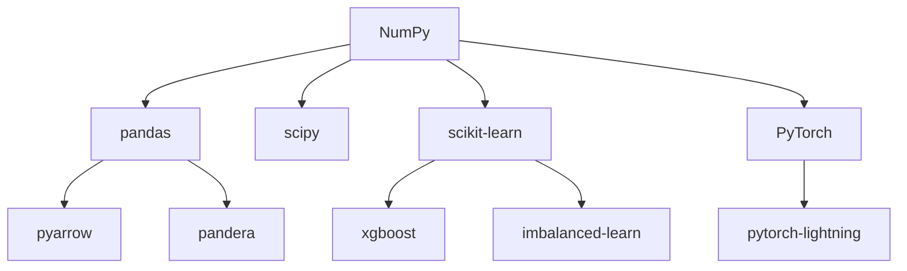

# Moola Dependency Matrix

## RunPod Template Comparison

| Package | Local Dev | PyTorch 2.2 Template | PyTorch 2.4 Template | Install Needed? |
|---------|-----------|---------------------|---------------------|-----------------|
| **Python** | 3.12.2 | 3.10 | 3.11 | ✅ (use template) |
| **PyTorch** | 2.2.2 | 2.2.0 | 2.4.0 | ✅ (use template) |
| **NumPy** | 1.26.4 | 1.26.x | 1.26.x or 2.0+ | ⚠️ (verify version) |
| **CUDA** | N/A | 12.1 | 12.4 | ✅ (use template) |
| | | | | |
| **pandas** | 2.3.3 | ❌ Not installed | ❌ Not installed | 🔴 Must install |
| **scipy** | 1.16.1 | ❌ Not installed | ❌ Not installed | 🔴 Must install |
| **scikit-learn** | 1.7.2 | ❌ Not installed | ❌ Not installed | 🔴 Must install |
| **xgboost** | 2.0.3 | ❌ Not installed | ❌ Not installed | 🔴 Must install |
| **imbalanced-learn** | 0.14.0 | ❌ Not installed | ❌ Not installed | 🔴 Must install |
| **pytorch-lightning** | 2.4.0 | ❌ Not installed | ❌ Not installed | 🔴 Must install |
| **mlflow** | Latest | ❌ Not installed | ❌ Not installed | 🔴 Must install |
| **loguru** | 0.7.3 | ❌ Not installed | ❌ Not installed | 🔴 Must install |
| **click** | 8.2.1 | ❌ Not installed | ❌ Not installed | 🔴 Must install |
| **typer** | 0.17.4 | ❌ Not installed | ❌ Not installed | 🔴 Must install |
| **hydra-core** | 1.3.2 | ❌ Not installed | ❌ Not installed | 🔴 Must install |
| **pydantic** | 2.11.7 | ❌ Not installed | ❌ Not installed | 🔴 Must install |
| **pyarrow** | 17.0.0 | ❌ Not installed | ❌ Not installed | 🔴 Must install |
| **pandera** | 0.26.1 | ❌ Not installed | ❌ Not installed | 🔴 Must install |

## Critical Version Constraints

### NumPy Compatibility

| Scenario | NumPy Version | Result |
|----------|---------------|--------|
| PyTorch 2.2 + NumPy 1.26.4 | ✅ 1.26.4 | WORKS |
| PyTorch 2.2 + NumPy 2.0+ | ❌ 2.0+ | FAILS (RuntimeError) |
| PyTorch 2.4 + NumPy 1.26.4 | ✅ 1.26.4 | WORKS |
| PyTorch 2.4 + NumPy 2.0+ | ✅ 2.0+ | WORKS |
| PyTorch 2.8 + NumPy 2.0+ | ✅ 2.0+ | WORKS |

**Rule:** Pin `numpy>=1.26.4,<2.0` for safety across all PyTorch versions

### Installation Order Dependencies



**Critical Order:**
1. NumPy (pin version first)
2. scipy (depends on NumPy)
3. pandas (depends on NumPy)
4. scikit-learn (depends on NumPy, scipy)
5. Everything else (xgboost, pytorch-lightning, etc.)

## Package Size Comparison

| Category | Local (448 packages) | RunPod Optimized (23 packages) | Savings |
|----------|---------------------|-------------------------------|---------|
| **Total Packages** | 448 | 23 | 95% reduction |
| **Install Size** | ~8.5 GB | ~2.1 GB | 75% smaller |
| **Install Time** | ~15 min | ~3 min | 80% faster |
| **Disk Usage** | High | Low | More space for data |

## Bloat Analysis: Unnecessary Local Packages

**Categories of packages NOT needed for RunPod training:**

### Development Tools (127 packages)
- pytest, pytest-*, black, ruff, mypy, pre-commit, etc.
- **Impact:** Build/test only, not runtime
- **Action:** Exclude from requirements-runpod.txt

### API/Deployment (45 packages)
- fastapi, uvicorn, starlette, httpx, aiohttp, etc.
- **Impact:** Inference serving only
- **Action:** Exclude from requirements-runpod.txt

### Data Engineering (38 packages)
- duckdb, polars, databento, greatexpectations, etc.
- **Impact:** Data prep only (done locally)
- **Action:** Exclude from requirements-runpod.txt

### Documentation (22 packages)
- sphinx, mkdocs, jupyter-related, etc.
- **Impact:** Docs generation only
- **Action:** Exclude from requirements-runpod.txt

### Cloud SDKs (31 packages)
- boto3, botocore, google-cloud-*, azure-*, etc.
- **Impact:** Cloud integration (not needed on RunPod)
- **Action:** Exclude from requirements-runpod.txt

### Misc/Bloat (185 packages)
- Various dependencies of excluded packages
- **Impact:** Transitive dependencies not needed
- **Action:** Auto-excluded when parents removed

## Conflict Resolution Guide

### Issue 1: "RuntimeError: Numpy is not available"

**Symptoms:**
```python
import torch
# RuntimeError: Numpy is not available
```

**Root Cause:** NumPy 2.0+ with PyTorch 2.2

**Solution:**
```bash
pip uninstall numpy -y
pip install "numpy>=1.26.4,<2.0"
```

### Issue 2: "ImportError: cannot import name '_ARRAY_API'"

**Symptoms:**
```python
import torch
# ImportError: cannot import name '_ARRAY_API' from 'numpy'
```

**Root Cause:** NumPy 2.1+ with PyTorch 2.4 (rare edge case)

**Solution:**
```bash
pip install "numpy>=1.26.4,<2.1"
```

### Issue 3: PyTorch Reinstalling Multiple Times

**Symptoms:**
```bash
pip install -r requirements.txt
# Downloading torch-2.2.2...
# Downloading torch-2.4.0...
# Downloading torch-2.2.2...
```

**Root Cause:** torch in requirements.txt conflicts with template

**Solution:**
- Remove `torch==*` from requirements-runpod.txt
- Use template's PyTorch installation

### Issue 4: scikit-learn NumPy Compatibility

**Symptoms:**
```python
import sklearn
# Warning: sklearn compiled with numpy 1.x, running with numpy 2.x
```

**Root Cause:** sklearn installed before NumPy pinned

**Solution:**
```bash
pip uninstall scikit-learn -y
pip install "numpy>=1.26.4,<2.0"
pip install "scikit-learn>=1.7,<2.0"
```

## Final Recommendations

### For PyTorch 2.2 Template
```txt
# Pin NumPy strictly
numpy>=1.26.4,<2.0

# All other packages with flexible versions
pandas>=2.3,<3.0
scipy>=1.14,<2.0
# ... etc
```

### For PyTorch 2.4+ Template (Recommended)
```txt
# Pin NumPy conservatively (allow 2.0 but test first)
numpy>=1.26.4,<2.0

# Future: After testing, can open to 2.0+
# numpy>=1.26.4,<2.1

# All other packages with flexible versions
pandas>=2.3,<3.0
scipy>=1.14,<2.0
# ... etc
```

## Verification Script

```python
#!/usr/bin/env python3
"""Verify RunPod environment dependencies."""

import sys

def check_imports():
    """Check all critical imports and versions."""
    checks = []

    try:
        import torch
        checks.append(("torch", torch.__version__, "✅"))
    except ImportError as e:
        checks.append(("torch", str(e), "❌"))

    try:
        import numpy as np
        version = np.__version__
        major = int(version.split('.')[0])
        status = "✅" if major < 2 else "⚠️"
        checks.append(("numpy", version, status))
    except ImportError as e:
        checks.append(("numpy", str(e), "❌"))

    try:
        import pandas
        checks.append(("pandas", pandas.__version__, "✅"))
    except ImportError as e:
        checks.append(("pandas", str(e), "❌"))

    try:
        import sklearn
        checks.append(("scikit-learn", sklearn.__version__, "✅"))
    except ImportError as e:
        checks.append(("scikit-learn", str(e), "❌"))

    try:
        import xgboost
        checks.append(("xgboost", xgboost.__version__, "✅"))
    except ImportError as e:
        checks.append(("xgboost", str(e), "❌"))

    try:
        import imblearn
        checks.append(("imbalanced-learn", imblearn.__version__, "✅"))
    except ImportError as e:
        checks.append(("imbalanced-learn", str(e), "❌"))

    try:
        import pytorch_lightning
        checks.append(("pytorch-lightning", pytorch_lightning.__version__, "✅"))
    except ImportError as e:
        checks.append(("pytorch-lightning", str(e), "❌"))

    # Print results
    print("\n" + "="*60)
    print("RunPod Environment Dependency Check")
    print("="*60)
    for name, version, status in checks:
        print(f"{status} {name:20s} {version}")

    # Check CUDA
    try:
        import torch
        if torch.cuda.is_available():
            print(f"✅ {'CUDA':20s} {torch.version.cuda}")
            print(f"✅ {'GPU':20s} {torch.cuda.get_device_name(0)}")
        else:
            print(f"❌ {'CUDA':20s} Not available")
    except:
        pass

    print("="*60)

    # Return exit code
    failed = [c for c in checks if c[2] == "❌"]
    if failed:
        print(f"\n❌ {len(failed)} checks failed")
        return 1
    else:
        print("\n✅ All checks passed")
        return 0

if __name__ == "__main__":
    sys.exit(check_imports())
```

Save as `verify_env.py` and run:
```bash
python verify_env.py
```
