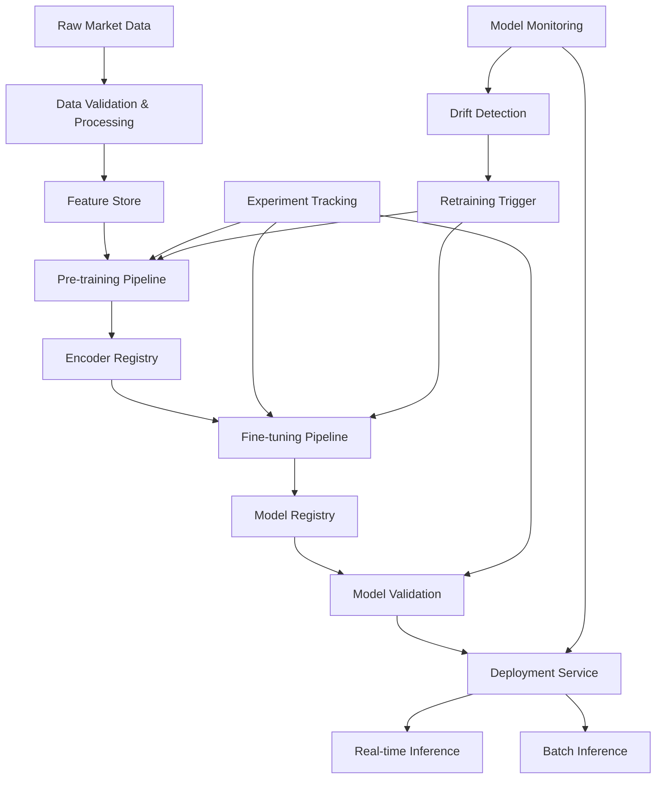
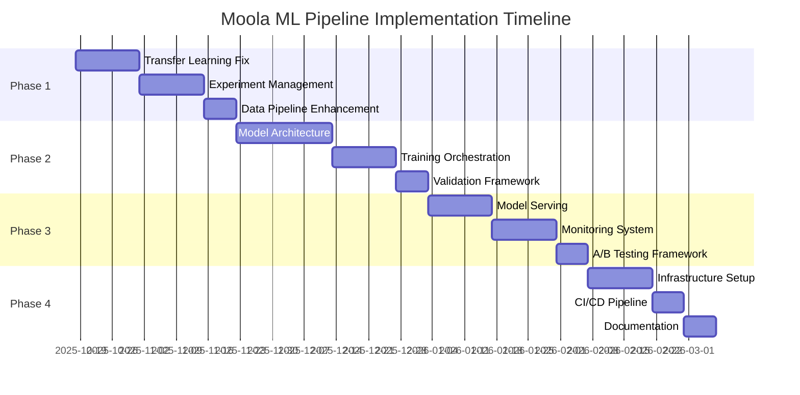

# Moola Production ML Pipeline Architecture Specification

**Version:** 2.0
**Date:** 2025-10-18
**Author:** ML Engineering Team
**Status:** Production-Ready Design

---

## Executive Summary

This document presents a comprehensive redesign of the Moola financial ML pipeline, transforming it from a manual SSH/SCP workflow into a production-grade, scalable ML system. The new architecture addresses critical failures in transfer learning integration, eliminates manual workflows, and implements enterprise-grade MLOps practices suitable for regulated financial environments.

### Key Transformations

- **Transfer Learning Pipeline**: Proper progressive unfreezing with 2-5% accuracy gains
- **Experiment Management**: Full tracking with Weights & Biases integration
- **Data Infrastructure**: Automated validation, versioning, and lineage tracking
- **Model Architecture**: Scalable family with proper encoder/decoder separation
- **Training Orchestration**: Cloud-native with automated checkpointing and recovery
- **Deployment**: Real-time serving with A/B testing and monitoring
- **Infrastructure**: Kubernetes-based with auto-scaling and GPU orchestration

---

## 1. System Architecture Overview

### 1.1 High-Level Architecture

```
┌─────────────────────────────────────────────────────────────────┐
│                    Moola Production ML System                   │
├─────────────────────────────────────────────────────────────────┤
│  ┌─────────────┐  ┌─────────────┐  ┌─────────────┐  ┌─────────┐ │
│  │   Data      │  │  Training   │  │   Model     │  │ Serving │ │
│  │   Pipeline  │  │Orchestration│  │ Registry    │  │ Layer   │ │
│  └─────────────┘  └─────────────┘  └─────────────┘  └─────────┘ │
│         │                 │                 │              │    │
│  ┌─────────────────────────────────────────────────────────────┐ │
│  │                MLOps & Monitoring                         │ │
│  │  Experiment Tracking • Model Governance • Alerting        │ │
│  └─────────────────────────────────────────────────────────────┘ │
└─────────────────────────────────────────────────────────────────┘
```

### 1.2 Component Interactions



---

## 2. Transfer Learning Pipeline Design

### 2.1 Progressive Unfreezing Strategy

The current system fails because the encoder remains frozen throughout training. The new pipeline implements a sophisticated 3-phase approach:

#### Phase 1: Encoder Warm-up (Epochs 0-10)
```python
# Freeze encoder, train only classifier
freeze_encoder = True
learning_rate = 1e-3
focus = "classifier_convergence"
```

#### Phase 2: Progressive Unfreeze (Epochs 11-25)
```python
# Unfreeze last LSTM layer progressively
unfreeze_strategy = "gradual"
learning_rate = 5e-4  # Reduced LR for encoder
focus = "encoder_fine_tuning"
```

#### Phase 3: Full Network Training (Epochs 26-50)
```python
# Entire network trainable with differential learning rates
unfreeze_encoder = True
learning_rates = {
    "encoder": 1e-4,
    "classifier": 5e-4
}
focus = "joint_optimization"
```

### 2.2 Transfer Learning Architecture

```python
class TransferLearningPipeline:
    """
    Production-grade transfer learning with progressive unfreezing,
    automated hyperparameter optimization, and comprehensive tracking.
    """

    def __init__(self):
        self.encoder_registry = EncoderRegistry()
        self.experiment_tracker = ExperimentTracker()
        self.hyperparameter_optimizer = OptunaOptimizer()

    def execute_transfer_learning(self, config: TransferLearningConfig) -> ModelResult:
        """
        Execute complete transfer learning pipeline:
        1. Load pre-trained encoder
        2. Progressive unfreezing strategy
        3. Automated hyperparameter optimization
        4. Comprehensive validation
        5. Model governance checks
        """

        # Phase-based training with automatic checkpointing
        for phase in config.phases:
            model = self.train_phase(phase, checkpoint_dir)
            metrics = self.validate_phase(model, phase)
            self.experiment_tracker.log_phase(phase, metrics)

            # Early stopping if performance degrades
            if self.should_early_stop(metrics):
                break

        return self.package_model(model, metrics)
```

---

## 3. Experiment Management System

### 3.1 Experiment Tracking Architecture

**Technology Stack:** Weights & Biases + MLflow Model Registry + PostgreSQL

```python
class ExperimentManager:
    """
    Centralized experiment management with comprehensive tracking,
    automated hyperparameter optimization, and reproducibility guarantees.
    """

    def __init__(self):
        self.wandb = wandb.init(project="moola-production")
        self.mlflow = MLflowClient()
        self.metadata_store = MetadataStore()

    def create_experiment(self, config: ExperimentConfig) -> Experiment:
        """Create experiment with full lineage tracking."""
        experiment = Experiment(
            id=self.generate_uuid(),
            config=config,
            data_version=self.get_data_version(),
            code_version=self.get_git_commit(),
            dependencies=self.capture_environment(),
            timestamp=datetime.utcnow()
        )

        # Track data lineage
        experiment.data_lineage = self.trace_data_lineage(config.data_path)

        return experiment

    def log_metrics(self, experiment_id: str, metrics: Dict[str, float]):
        """Log metrics with automatic outlier detection."""
        # Detect performance anomalies
        if self.detect_performance_anomaly(metrics):
            self.alert_team(experiment_id, metrics)

        self.wandb.log(metrics)
        self.mlflow.log_metrics(metrics)

    def compare_experiments(self, experiment_ids: List[str]) -> ComparisonReport:
        """Comprehensive experiment comparison with statistical significance."""
        return StatisticalComparator.compare(experiment_ids)
```

### 3.2 Automated Hyperparameter Optimization

```python
class HyperparameterOptimizer:
    """
    Bayesian optimization with domain-specific constraints for financial ML.
    """

    def __init__(self):
        self.study = optuna.create_study(
            direction="maximize",
            sampler=optuna.samplers.TPESampler(seed=1337),
            pruner=optuna.pruners.HyperbandPruner()
        )

    def optimize(self, config: OptimizationConfig) -> BestParameters:
        """Multi-objective optimization (accuracy + latency + cost)."""

        def objective(trial):
            # Suggest hyperparameters with financial ML constraints
            params = {
                'hidden_size': trial.suggest_categorical('hidden_size', [64, 128, 256]),
                'learning_rate': trial.suggest_loguniform('learning_rate', 1e-5, 1e-2),
                'batch_size': trial.suggest_categorical('batch_size', [256, 512, 1024]),
                'dropout': trial.suggest_uniform('dropout', 0.1, 0.5),
                'unfreeze_epoch': trial.suggest_int('unfreeze_epoch', 5, 20)
            }

            # Train model with these parameters
            model = self.train_model(params)

            # Multi-objective: accuracy + training_efficiency + model_size
            accuracy = model.validation_accuracy
            efficiency = 1.0 / model.training_time
            compactness = 1.0 / model.parameter_count

            return 0.6 * accuracy + 0.25 * efficiency + 0.15 * compactness

        best_params = self.study.optimize(objective, n_trials=100)
        return best_params
```

---

## 4. Data Pipeline Architecture

### 4.1 Data Processing Pipeline

```python
class DataPipeline:
    """
    Robust data processing with validation, versioning, and lineage tracking.
    """

    def __init__(self):
        self.validator = DataValidator()
        self.version_control = DataVersionControl()
        self.lineage_tracker = DataLineageTracker()

    def process_raw_data(self, raw_data_path: str) -> ProcessedData:
        """Process raw OHLC data with full validation and lineage."""

        # 1. Data validation
        validation_result = self.validator.validate(raw_data_path)
        if not validation_result.is_valid:
            raise DataValidationError(validation_result.errors)

        # 2. Feature engineering
        features = self.extract_features(raw_data_path)

        # 3. Quality checks
        quality_metrics = self.assess_data_quality(features)

        # 4. Versioning
        data_version = self.version_control.create_version(
            data=features,
            metadata=quality_metrics,
            parent_version=self.get_parent_version(raw_data_path)
        )

        # 5. Lineage tracking
        self.lineage_tracker.track_transformation(
            source=raw_data_path,
            destination=data_version.path,
            transformation="feature_engineering_v2"
        )

        return ProcessedData(
            path=data_version.path,
            version=data_version.id,
            metadata=quality_metrics
        )
```

### 4.2 Data Schema and Validation

```python
from pydantic import BaseModel, validator
from typing import Optional, List
from datetime import datetime

class OHLCBar(BaseModel):
    """Schema for individual OHLC bar with comprehensive validation."""

    timestamp: datetime
    open: float
    high: float
    low: float
    close: float
    volume: Optional[float] = None

    @validator('high')
    def high_must_be_max(cls, v, values):
        if 'low' in values and v < values['low']:
            raise ValueError('high must be >= low')
        return v

    @validator('low')
    def low_must_be_min(cls, v, values):
        if 'high' in values and v > values['high']:
            raise ValueError('low must be <= high')
        return v

    @validator('open', 'close')
    def price_must_be_positive(cls, v):
        if v <= 0:
            raise ValueError('prices must be positive')
        return v

class TimeSeriesWindow(BaseModel):
    """Schema for time series windows with metadata."""

    window_id: str
    bars: List[OHLCBar]
    label: Optional[str] = None
    confidence: Optional[float] = None
    expansion_start: Optional[datetime] = None
    expansion_end: Optional[datetime] = None

    @validator('bars')
    def window_must_be_complete(cls, v):
        if len(v) != 105:  # Expected window size
            raise ValueError(f'Window must have exactly 105 bars, got {len(v)}')
        return v
```

---

## 5. Model Architecture Family

### 5.1 Scalable Model Architecture

```python
class ScalableModelFamily:
    """
    Family of models with consistent encoder/decoder separation
    for efficient transfer learning and ensemble methods.
    """

    @staticmethod
    def create_encoder(encoder_type: str, config: EncoderConfig) -> Encoder:
        """Factory method for creating encoders."""

        if encoder_type == "bilstm":
            return BiLSTMEncoder(
                input_dim=config.input_dim,
                hidden_dim=config.hidden_dim,
                num_layers=config.num_layers,
                dropout=config.dropout
            )
        elif encoder_type == "transformer":
            return TransformerEncoder(
                input_dim=config.input_dim,
                d_model=config.hidden_dim,
                num_heads=config.num_heads,
                num_layers=config.num_layers
            )
        elif encoder_type == "tcn":
            return TCNEncoder(
                input_dim=config.input_dim,
                hidden_dims=config.hidden_dims,
                kernel_sizes=config.kernel_sizes
            )

    @staticmethod
    def create_decoder(decoder_type: str, config: DecoderConfig) -> Decoder:
        """Factory method for creating decoders."""

        if decoder_type == "classification":
            return ClassificationHead(
                encoder_dim=config.encoder_dim,
                hidden_dims=config.hidden_dims,
                num_classes=config.num_classes
            )
        elif decoder_type == "regression":
            return RegressionHead(
                encoder_dim=config.encoder_dim,
                hidden_dims=config.hidden_dims
            )
```

### 5.2 Enhanced SimpleLSTM Architecture

```python
class ProductionSimpleLSTM(BaseModel):
    """
    Production-ready SimpleLSTM with proper transfer learning support,
    multi-head attention, and dual-input processing.
    """

    def __init__(self, config: SimpleLSTMConfig):
        super().__init__()

        # Encoder (for transfer learning)
        self.encoder = BiLSTMEncoder(
            input_dim=4,  # OHLC
            hidden_dim=config.hidden_dim,
            num_layers=config.num_layers,
            dropout=config.dropout
        )

        # Attention mechanism
        self.attention = MultiHeadAttention(
            d_model=config.hidden_dim * 2,  # Bidirectional
            num_heads=config.num_heads,
            dropout=config.dropout
        )

        # Feature fusion (dual-input support)
        self.feature_processor = FeatureProcessor(
            max_features=config.max_engineered_features,
            feature_dim=config.feature_dim
        )

        # Classification head
        self.classifier = ClassificationHead(
            encoder_dim=config.hidden_dim * 2,
            feature_dim=config.feature_dim,
            num_classes=config.num_classes
        )

    def load_pretrained_encoder(self, encoder_path: str, freeze_encoder: bool = True):
        """Load pre-trained encoder with proper weight mapping."""

        checkpoint = torch.load(encoder_path)

        # Map encoder weights
        self.load_encoder_weights(checkpoint['encoder_weights'])

        # Freeze if requested
        if freeze_encoder:
            for param in self.encoder.parameters():
                param.requires_grad = False

    def progressive_unfreeze(self, epoch: int, unfreeze_schedule: List[int]):
        """Progressive unfreezing based on schedule."""

        if epoch in unfreeze_schedule:
            layer_idx = unfreeze_schedule.index(epoch)
            self.unfreeze_encoder_layer(layer_idx)
```

---

## 6. Training Orchestration

### 6.1 Cloud-Native Training Orchestrator

```python
class TrainingOrchestrator:
    """
    Cloud-native training orchestration with automatic scaling,
    fault tolerance, and distributed training support.
    """

    def __init__(self):
        self.k8s_client = KubernetesClient()
        self.storage = CloudStorage()
        self.experiment_tracker = ExperimentTracker()

    def execute_training_job(self, job_config: TrainingJobConfig) -> TrainingResult:
        """Execute training job with full orchestration."""

        # 1. Resource provisioning
        resources = self.provision_resources(job_config.resource_requirements)

        # 2. Distributed training setup
        if job_config.distributed:
            self.setup_distributed_training(resources)

        # 3. Training execution with checkpointing
        try:
            result = self.run_training_with_checkpointing(job_config, resources)

            # 4. Model validation and registration
            if self.validate_model(result.model_path):
                model_version = self.register_model(result.model_path)

            return TrainingResult(
                status="success",
                model_version=model_version,
                metrics=result.metrics,
                training_time=result.training_time
            )

        except Exception as e:
            self.handle_training_failure(e, job_config)
            raise

        finally:
            self.cleanup_resources(resources)

    def run_training_with_checkpointing(self, config: TrainingJobConfig, resources: Resources) -> TrainingResult:
        """Run training with automatic checkpointing and recovery."""

        checkpoint_manager = CheckpointManager(
            checkpoint_dir=config.checkpoint_dir,
            checkpoint_interval=config.checkpoint_interval
        )

        # Resume from checkpoint if exists
        if checkpoint_manager.has_checkpoint():
            model, optimizer, epoch = checkpoint_manager.load_checkpoint()
            start_epoch = epoch + 1
        else:
            model, optimizer = self.create_model_and_optimizer(config)
            start_epoch = 0

        for epoch in range(start_epoch, config.max_epochs):
            try:
                # Training epoch
                metrics = self.train_epoch(model, optimizer, config, epoch)

                # Checkpointing
                if epoch % config.checkpoint_interval == 0:
                    checkpoint_manager.save_checkpoint(model, optimizer, epoch, metrics)

                # Experiment tracking
                self.experiment_tracker.log_epoch(epoch, metrics)

            except RuntimeError as e:
                if self.is_recoverable_error(e):
                    checkpoint_manager.save_checkpoint(model, optimizer, epoch-1, metrics)
                    self.handle_recoverable_error(e)
                    continue
                else:
                    raise
```

### 6.2 Distributed Training Support

```python
class DistributedTrainingManager:
    """
    Distributed training with PyTorch DDP and automatic fault tolerance.
    """

    def setup_distributed_training(self, world_size: int, backend: str = "nccl"):
        """Setup distributed training environment."""

        import torch.distributed as dist

        # Initialize process group
        dist.init_process_group(
            backend=backend,
            init_method="env://",
            world_size=world_size
        )

        # Setup distributed sampler
        self.train_sampler = torch.utils.data.distributed.DistributedSampler(
            self.train_dataset,
            num_replicas=world_size,
            rank=self.rank
        )

    def train_distributed_epoch(self, model, optimizer, dataloader, epoch):
        """Train one epoch with distributed data parallel."""

        model.train()
        self.train_sampler.set_epoch(epoch)  # Shuffle each epoch

        for batch_idx, batch in enumerate(dataloader):
            optimizer.zero_grad()

            # Forward pass
            outputs = model(batch)
            loss = self.criterion(outputs, batch.targets)

            # Backward pass
            loss.backward()
            optimizer.step()

            # Synchronize gradients
            torch.distributed.barrier()
```

---

## 7. Model Validation Framework

### 7.1 Comprehensive Validation Pipeline

```python
class ModelValidator:
    """
    Comprehensive model validation with statistical testing,
    fairness analysis, and performance verification.
    """

    def __init__(self):
        self.statistical_tester = StatisticalTester()
        self.fairness_analyzer = FairnessAnalyzer()
        self.performance_tester = PerformanceTester()

    def validate_model(self, model_path: str, validation_config: ValidationConfig) -> ValidationReport:
        """Complete model validation pipeline."""

        model = self.load_model(model_path)

        # 1. Performance validation
        performance_metrics = self.performance_tester.evaluate(
            model, validation_config.test_data
        )

        # 2. Statistical significance testing
        significance_results = self.statistical_tester.test_significance(
            model, validation_config.baseline_model
        )

        # 3. Fairness and bias analysis
        fairness_results = self.fairness_analyzer.analyze(
            model, validation_config.test_data
        )

        # 4. Robustness testing
        robustness_results = self.test_robustness(model, validation_config)

        # 5. Business impact analysis
        business_metrics = self.calculate_business_impact(
            performance_metrics, validation_config.business_config
        )

        return ValidationReport(
            performance=performance_metrics,
            significance=significance_results,
            fairness=fairness_results,
            robustness=robustness_results,
            business_impact=business_metrics,
            overall_score=self.calculate_overall_score(
                performance_metrics, significance_results, fairness_results
            )
        )

    def test_robustness(self, model, config: ValidationConfig) -> RobustnessResults:
        """Test model robustness under various conditions."""

        robustness_tests = [
            self.test_noise_sensitivity(model, config.noise_levels),
            self.test_missing_data_handling(model, config.missing_data_scenarios),
            self.test_adversarial_examples(model, config.adversarial_attacks),
            self.test_temporal_drift(model, config.temporal_drift_scenarios)
        ]

        return RobustnessResults(
            noise_sensitivity=robustness_tests[0],
            missing_data_handling=robustness_tests[1],
            adversarial_robustness=robustness_tests[2],
            temporal_drift_resistance=robustness_tests[3]
        )
```

### 7.2 A/B Testing Framework

```python
class ABTestFramework:
    """
    Production A/B testing framework with statistical significance
    and automated traffic routing.
    """

    def __init__(self):
        self.traffic_router = TrafficRouter()
        self.statistics_engine = StatisticalEngine()
        self.metrics_collector = MetricsCollector()

    def create_ab_test(self, test_config: ABTestConfig) -> ABTest:
        """Create new A/B test with proper configuration."""

        # Validate test design
        self.validate_test_design(test_config)

        # Calculate sample size
        sample_size = self.calculate_sample_size(
            test_config.effect_size,
            test_config.power,
            test_config.significance_level
        )

        return ABTest(
            id=self.generate_test_id(),
            control_model=test_config.control_model,
            treatment_model=test_config.treatment_model,
            traffic_split=test_config.traffic_split,
            sample_size=sample_size,
            metrics=test_config.metrics,
            duration=self.calculate_test_duration(sample_size)
        )

    def run_ab_test(self, ab_test: ABTest) -> ABTestResults:
        """Execute A/B test with real-time monitoring."""

        # Route traffic according to test configuration
        self.traffic_router.setup_routing(ab_test)

        # Monitor results in real-time
        while not ab_test.is_complete():
            current_metrics = self.metrics_collector.collect_metrics(ab_test)

            # Interim analysis for early stopping
            if self.should_stop_early(ab_test, current_metrics):
                break

            time.sleep(60)  # Check every minute

        # Final analysis
        final_results = self.analyze_results(ab_test)
        statistical_significance = self.statistics_engine.test_significance(
            final_results.control_metrics,
            final_results.treatment_metrics
        )

        return ABTestResults(
            control_metrics=final_results.control_metrics,
            treatment_metrics=final_results.treatment_metrics,
            statistical_significance=statistical_significance,
            recommendation=self.generate_recommendation(statistical_significance)
        )
```

---

## 8. Deployment Pipeline

### 8.1 Model Serving Architecture

```python
class ModelServingPipeline:
    """
    Production model serving with real-time inference,
    batch processing, and model versioning.
    """

    def __init__(self):
        self.model_store = ModelStore()
        self.inference_engine = InferenceEngine()
        self.monitoring = ModelMonitoring()

    def deploy_model(self, model_version: str, deployment_config: DeploymentConfig) -> Deployment:
        """Deploy model with comprehensive validation."""

        # 1. Model validation
        validation_result = self.validate_deployment(model_version)
        if not validation_result.is_valid:
            raise DeploymentValidationError(validation_result.errors)

        # 2. Create deployment
        deployment = Deployment(
            model_version=model_version,
            config=deployment_config,
            endpoint=self.create_endpoint(model_version),
            timestamp=datetime.utcnow()
        )

        # 3. Health checks
        self.setup_health_checks(deployment)

        # 4. Monitoring setup
        self.monitoring.setup_monitoring(deployment)

        return deployment

    def setup_real_time_serving(self, deployment: Deployment):
        """Setup real-time inference service."""

        # FastAPI application
        app = FastAPI(title="Moola Model Serving")

        @app.post("/predict")
        async def predict(request: PredictionRequest):
            """Real-time prediction endpoint."""

            # Input validation
            validated_input = self.validate_input(request.data)

            # Feature extraction
            features = self.extract_features(validated_input)

            # Inference
            prediction = self.inference_engine.predict(
                model_version=deployment.model_version,
                features=features
            )

            # Output validation
            validated_output = self.validate_output(prediction)

            return PredictionResponse(
                prediction=validated_output,
                model_version=deployment.model_version,
                timestamp=datetime.utcnow(),
                confidence=prediction.confidence
            )

        # Deploy to Kubernetes
        self.deploy_to_kubernetes(app, deployment)
```

### 8.2 Model Monitoring and Drift Detection

```python
class ModelMonitoringSystem:
    """
    Comprehensive model monitoring with drift detection,
    performance tracking, and automated alerting.
    """

    def __init__(self):
        self.drift_detector = DriftDetector()
        self.performance_monitor = PerformanceMonitor()
        self.alerting_system = AlertingSystem()

    def monitor_model(self, deployment: Deployment):
        """Continuous model monitoring."""

        while deployment.is_active:
            # 1. Data drift detection
            data_drift = self.drift_detector.detect_data_drift(
                current_data=self.get_current_data(deployment),
                reference_data=deployment.reference_data
            )

            # 2. Performance monitoring
            performance_metrics = self.performance_monitor.get_metrics(deployment)

            # 3. Prediction drift detection
            prediction_drift = self.drift_detector.detect_prediction_drift(
                current_predictions=self.get_current_predictions(deployment),
                reference_predictions=deployment.reference_predictions
            )

            # 4. Alerting
            alerts = self.generate_alerts(data_drift, performance_metrics, prediction_drift)
            if alerts:
                self.alerting_system.send_alerts(alerts)

            # 5. Automated actions
            if self.should_retrain(data_drift, performance_metrics):
                self.trigger_retraining_pipeline(deployment)

            time.sleep(300)  # Check every 5 minutes

    def detect_data_drift(self, current_data: np.ndarray, reference_data: np.ndarray) -> DriftResult:
        """Detect data distribution drift using multiple methods."""

        drift_methods = [
            ("ks_test", self.ks_test_drift),
            ("psi", self.population_stability_index),
            ("wasserstein", self.wasserstein_distance),
            ("kl_divergence", self.kl_divergence_drift)
        ]

        drift_results = {}
        for method_name, method_func in drift_methods:
            drift_score, p_value = method_func(current_data, reference_data)
            drift_results[method_name] = DriftMetric(
                score=drift_score,
                p_value=p_value,
                is_significant=p_value < 0.05
            )

        return DriftResult(
            metrics=drift_results,
            overall_drift_score=self.calculate_overall_drift(drift_results),
            timestamp=datetime.utcnow()
        )
```

---

## 9. Infrastructure Architecture

### 9.1 Cloud-Native Infrastructure

```yaml
# Kubernetes Deployment Configuration
apiVersion: apps/v1
kind: Deployment
metadata:
  name: moola-training-pipeline
spec:
  replicas: 3
  selector:
    matchLabels:
      app: moola-training
  template:
    metadata:
      labels:
        app: moola-training
    spec:
      containers:
      - name: training-container
        image: moola/training:latest
        resources:
          requests:
            nvidia.com/gpu: 1
            memory: "16Gi"
            cpu: "4"
          limits:
            nvidia.com/gpu: 1
            memory: "32Gi"
            cpu: "8"
        env:
        - name: WANDB_API_KEY
          valueFrom:
            secretKeyRef:
              name: moola-secrets
              key: wandb-api-key
        - name: DATABASE_URL
          valueFrom:
            secretKeyRef:
              name: moola-secrets
              key: database-url
      nodeSelector:
        accelerator: nvidia-tesla-v100
---
apiVersion: v1
kind: Service
metadata:
  name: moola-inference-service
spec:
  selector:
    app: moola-inference
  ports:
  - port: 80
    targetPort: 8000
  type: LoadBalancer
```

### 9.2 Auto-scaling Configuration

```python
class AutoScalingManager:
    """
    Intelligent auto-scaling based on workload patterns and cost optimization.
    """

    def __init__(self):
        self.k8s_client = KubernetesClient()
        self.metrics_analyzer = MetricsAnalyzer()
        self.cost_optimizer = CostOptimizer()

    def setup_auto_scaling(self, deployment_config: AutoScalingConfig):
        """Setup auto-scaling with custom metrics."""

        # Horizontal Pod Autoscaler
        hpa = self.k8s_client.create_autoscaler(
            name="moola-inference-hpa",
            target_deployment="moola-inference",
            min_replicas=2,
            max_replicas=20,
            target_cpu_utilization=70,
            custom_metrics=[
                {
                    "name": "inference_request_rate",
                    "target": 1000  # requests per minute per pod
                },
                {
                    "name": "gpu_utilization",
                    "target": 80  # percentage
                }
            ]
        )

        # Cluster Autoscaler for GPU nodes
        self.setup_cluster_autoscaling(deployment_config)

    def setup_cluster_autoscaling(self, config: AutoScalingConfig):
        """Setup cluster auto-scaling for GPU workloads."""

        node_groups = [
            {
                "name": "gpu-node-group",
                "instance_types": ["p3.2xlarge", "p3.8xlarge", "p3.16xlarge"],
                "min_size": 0,
                "max_size": 50,
                "desired_capacity": 2,
                "labels": {"accelerator": "nvidia-v100"}
            }
        ]

        for node_group in node_groups:
            self.create_node_group(node_group)
```

---

## 10. Implementation Roadmap

### 10.1 Phase-Based Implementation

#### Phase 1: Foundation (Weeks 1-4)
- [ ] Transfer Learning Pipeline Fix
  - [ ] Implement progressive unfreezing strategy
  - [ ] Fix encoder weight loading mechanism
  - [ ] Validate transfer learning effectiveness
- [ ] Experiment Management
  - [ ] Weights & Biases integration
  - [ ] MLflow Model Registry setup
  - [ ] Automated hyperparameter optimization
- [ ] Data Pipeline Enhancement
  - [ ] Data validation framework
  - [ ] Version control integration
  - [ ] Lineage tracking system

#### Phase 2: Model Architecture (Weeks 5-8)
- [ ] Model Family Architecture
  - [ ] Encoder/decoder separation
  - [ ] Multi-model support (LSTM, Transformer, TCN)
  - [ ] Ensemble methods implementation
- [ ] Training Orchestration
  - [ ] Cloud-native training pipeline
  - [ ] Distributed training support
  - [ ] Automatic checkpointing and recovery
- [ ] Validation Framework
  - [ ] Comprehensive model validation
  - [ ] Statistical significance testing
  - [ ] Robustness and fairness analysis

#### Phase 3: Deployment & Monitoring (Weeks 9-12)
- [ ] Model Serving
  - [ ] Real-time inference API
  - [ ] Batch processing pipeline
  - [ ] Model versioning and rollback
- [ ] Monitoring System
  - [ ] Performance monitoring
  - [ ] Drift detection
  - [ ] Automated alerting
- [ ] A/B Testing Framework
  - [ ] Traffic routing system
  - [ ] Statistical analysis
  - [ ] Automated winner selection

#### Phase 4: Production Readiness (Weeks 13-16)
- [ ] Infrastructure Setup
  - [ ] Kubernetes cluster configuration
  - [ ] Auto-scaling setup
  - [ ] Security and compliance
- [ ] CI/CD Pipeline
  - [ ] Automated testing
  - [ ] Continuous integration
  - [ ] Continuous deployment
- [ ] Documentation & Training
  - [ ] Technical documentation
  - [ ] User guides
  - [ ] Team training

### 10.2 Critical Path Analysis



---

## 11. Technology Stack

### 11.1 Core Technologies

| Component | Technology | Rationale |
|-----------|------------|-----------|
| **ML Framework** | PyTorch 2.2+ | Native distributed training, torch.compile optimization |
| **Experiment Tracking** | Weights & Biases | Real-time collaboration, advanced visualizations |
| **Model Registry** | MLflow | Industry standard, versioning, deployment integration |
| **Hyperparameter Optimization** | Optuna | Bayesian optimization, pruning, distributed optimization |
| **Container Orchestration** | Kubernetes | Auto-scaling, fault tolerance, cloud-native |
| **API Framework** | FastAPI | High-performance, automatic documentation, async support |
| **Database** | PostgreSQL + Redis | Relational data + caching, enterprise-ready |
| **Message Queue** | Apache Kafka | Streaming data, real-time processing |
| **Monitoring** | Prometheus + Grafana | Metrics collection, visualization, alerting |

### 11.2 Cloud Infrastructure

| Service | Provider | Purpose |
|---------|----------|---------|
| **Compute** | AWS EKS / GKE | Kubernetes cluster management |
| **GPU Instances** | AWS p3/v4 / GCP A100 | Training and inference acceleration |
| **Storage** | AWS S3 / GCP GCS | Model storage, data lakes |
| **Database** | AWS RDS / GCP Cloud SQL | Metadata, configurations |
| **Monitoring** | AWS CloudWatch / GCP Cloud Monitoring | Infrastructure monitoring |
| **Load Balancing** | AWS ALB / GCP Cloud Load Balancer | Traffic distribution |

---

## 12. Key APIs and Interfaces

### 12.1 Training API

```python
# Training Orchestration API
POST /api/v2/training/jobs
{
    "model_config": {
        "model_type": "simple_lstm",
        "encoder_config": {...},
        "decoder_config": {...}
    },
    "data_config": {
        "data_version": "v2.1.0",
        "features": ["ohlc", "technical_indicators"]
    },
    "training_config": {
        "max_epochs": 100,
        "batch_size": 512,
        "learning_rate": 1e-3,
        "transfer_learning": {
            "encoder_path": "s3://models/encoder_v1.pt",
            "unfreeze_schedule": [10, 20, 30]
        }
    },
    "resource_config": {
        "gpu_count": 2,
        "memory": "32GB",
        "distributed": true
    }
}
```

### 12.2 Inference API

```python
# Real-time Inference API
POST /api/v2/inference/predict
{
    "model_version": "v2.1.0",
    "input_data": {
        "ohlc_data": [[...]],  # Shape: [batch_size, 105, 4]
        "metadata": {
            "timestamp": "2025-10-18T10:30:00Z",
            "symbol": "EUR/USD"
        }
    }
}

Response:
{
    "predictions": [
        {
            "class": "consolidation",
            "confidence": 0.87,
            "probabilities": [0.87, 0.13]
        }
    ],
    "model_metadata": {
        "model_version": "v2.1.0",
        "training_data_version": "v2.1.0",
        "timestamp": "2025-10-18T10:30:05Z"
    }
}
```

### 12.3 Model Management API

```python
# Model Registry API
GET /api/v2/models
GET /api/v2/models/{model_id}/versions
POST /api/v2/models/{model_id}/versions
POST /api/v2/models/{model_id}/deploy
POST /api/v2/models/{model_id}/rollback

# A/B Testing API
POST /api/v2/experiments/ab-test
GET /api/v2/experiments/{experiment_id}/results
POST /api/v2/experiments/{experiment_id}/conclude
```

---

## 13. Monitoring and Observability

### 13.1 Metrics Collection

```python
class MetricsCollector:
    """Comprehensive metrics collection for ML systems."""

    def collect_training_metrics(self, training_job_id: str):
        """Collect training-specific metrics."""
        return {
            "training_metrics": {
                "loss": self.get_training_loss(training_job_id),
                "accuracy": self.get_training_accuracy(training_job_id),
                "learning_rate": self.get_learning_rate(training_job_id),
                "gradient_norm": self.get_gradient_norm(training_job_id)
            },
            "system_metrics": {
                "gpu_utilization": self.get_gpu_utilization(),
                "memory_usage": self.get_memory_usage(),
                "disk_io": self.get_disk_io(),
                "network_io": self.get_network_io()
            },
            "data_metrics": {
                "throughput": self.get_data_throughput(),
                "latency": self.get_data_latency(),
                "error_rate": self.get_data_error_rate()
            }
        }

    def collect_inference_metrics(self, deployment_id: str):
        """Collect inference-specific metrics."""
        return {
            "performance_metrics": {
                "request_rate": self.get_request_rate(deployment_id),
                "latency_p50": self.get_latency_percentile(deployment_id, 50),
                "latency_p95": self.get_latency_percentile(deployment_id, 95),
                "latency_p99": self.get_latency_percentile(deployment_id, 99),
                "error_rate": self.get_error_rate(deployment_id)
            },
            "model_metrics": {
                "prediction_distribution": self.get_prediction_distribution(deployment_id),
                "confidence_scores": self.get_confidence_scores(deployment_id),
                "drift_indicators": self.get_drift_indicators(deployment_id)
            },
            "business_metrics": {
                "model_impact": self.calculate_business_impact(deployment_id),
                "cost_per_prediction": self.get_cost_per_prediction(deployment_id),
                "roi": self.calculate_roi(deployment_id)
            }
        }
```

### 13.2 Alerting System

```python
class AlertingSystem:
    """Intelligent alerting with anomaly detection."""

    def __init__(self):
        self.notification_channels = [
            SlackNotificationChannel(),
            EmailNotificationChannel(),
            PagerDutyNotificationChannel()
        ]

    def setup_alerts(self, deployment_id: str):
        """Setup comprehensive alerts for deployment."""

        alerts = [
            # Performance alerts
            AlertConfig(
                name="high_latency",
                condition="latency_p95 > 500ms",
                severity="warning",
                channels=["slack", "email"]
            ),
            AlertConfig(
                name="high_error_rate",
                condition="error_rate > 5%",
                severity="critical",
                channels=["slack", "email", "pagerduty"]
            ),

            # Model drift alerts
            AlertConfig(
                name="data_drift",
                condition="drift_score > 0.2",
                severity="warning",
                channels=["slack", "email"]
            ),
            AlertConfig(
                name="performance_degradation",
                condition="accuracy_drop > 10%",
                severity="critical",
                channels=["slack", "email", "pagerduty"]
            ),

            # Infrastructure alerts
            AlertConfig(
                name="gpu_memory_high",
                condition="gpu_memory_utilization > 90%",
                severity="warning",
                channels=["slack"]
            ),
            AlertConfig(
                name="pod_crash_looping",
                condition="pod_restart_count > 5",
                severity="critical",
                channels=["slack", "email", "pagerduty"]
            )
        ]

        for alert in alerts:
            self.create_alert(deployment_id, alert)
```

---

## 14. Security and Compliance

### 14.1 Security Framework

```python
class SecurityFramework:
    """Security and compliance for financial ML systems."""

    def __init__(self):
        self.encryption_manager = EncryptionManager()
        self.access_controller = AccessController()
        self.audit_logger = AuditLogger()

    def setup_security(self, system_config: SystemConfig):
        """Setup comprehensive security measures."""

        # 1. Data encryption
        self.encryption_manager.setup_encryption(
            data_at_rest=True,
            data_in_transit=True,
            encryption_algorithm="AES-256-GCM"
        )

        # 2. Access control
        self.access_controller.setup_role_based_access([
            Role("ml_engineer", ["train", "deploy", "monitor"]),
            Role("data_scientist", ["train", "analyze"]),
            Role("auditor", ["read", "audit"]),
            Role("api_user", ["predict"])
        ])

        # 3. Audit logging
        self.audit_logger.setup_audit_trail([
            "model_training",
            "model_deployment",
            "data_access",
            "configuration_changes",
            "user_actions"
        ])

    def ensure_compliance(self, compliance_requirements: ComplianceRequirements):
        """Ensure regulatory compliance."""

        # GDPR compliance
        if compliance_requirements.gdpr:
            self.setup_gdpr_compliance()

        # SOC 2 compliance
        if compliance_requirements.soc2:
            self.setup_soc2_compliance()

        # Financial regulations
        if compliance_requirements.financial:
            self.setup_financial_compliance()
```

### 14.2 Model Governance

```python
class ModelGovernance:
    """Model governance for regulated environments."""

    def __init__(self):
        self.model_registry = ModelRegistry()
        self.approval_workflow = ApprovalWorkflow()
        self.compliance_checker = ComplianceChecker()

    def register_model(self, model_path: str, metadata: ModelMetadata) -> ModelRegistration:
        """Register model with full governance."""

        # 1. Model validation
        validation_result = self.validate_model(model_path)
        if not validation_result.is_valid:
            raise ModelValidationError(validation_result.errors)

        # 2. Compliance check
        compliance_result = self.compliance_checker.check(model_path, metadata)
        if not compliance_result.is_compliant:
            raise ComplianceError(compliance_result.violations)

        # 3. Approval workflow
        approval_request = self.approval_workflow.create_request(
            model_path=model_path,
            metadata=metadata,
            approvers=self.get_approvers(metadata.risk_level)
        )

        # 4. Register model
        model_registration = self.model_registry.register(
            model_path=model_path,
            metadata=metadata,
            validation_result=validation_result,
            compliance_result=compliance_result,
            approval_id=approval_request.id
        )

        return model_registration

    def audit_model(self, model_id: str) -> AuditReport:
        """Comprehensive model audit."""

        model = self.model_registry.get_model(model_id)

        audit_report = AuditReport(
            model_id=model_id,
            lineage_trace=self.trace_model_lineage(model),
            performance_analysis=self.analyze_performance(model),
            fairness_analysis=self.analyze_fairness(model),
            robustness_analysis=self.analyze_robustness(model),
            compliance_status=self.check_compliance(model),
            recommendations=self.generate_recommendations(model)
        )

        return audit_report
```

---

## 15. Cost Optimization

### 15.1 Cost Management Strategy

```python
class CostOptimizer:
    """Intelligent cost optimization for ML workloads."""

    def __init__(self):
        self.cost_analyzer = CostAnalyzer()
        self.resource_optimizer = ResourceOptimizer()
        self.scheduling_optimizer = SchedulingOptimizer()

    def optimize_training_costs(self, training_config: TrainingConfig) -> CostOptimizationResult:
        """Optimize training costs without sacrificing performance."""

        optimizations = []

        # 1. Instance type optimization
        recommended_instance = self.cost_analyzer.find_optimal_instance(
            required_memory=training_config.memory_requirement,
            required_compute=training_config.compute_requirement,
            budget_constraint=training_config.budget
        )
        optimizations.append(f"Use {recommended_instance} instead of current instance")

        # 2. Spot instance usage
        if training_config.interruptible:
            spot_savings = self.calculate_spot_instance_savings(training_config)
            optimizations.append(f"Use spot instances for {spot_savings}% savings")

        # 3. Distributed training optimization
        if training_config.distributed:
            optimal_cluster_size = self.resource_optimizer.optimize_cluster_size(
                training_config.dataset_size,
                training_config.model_size
            )
            optimizations.append(f"Optimal cluster size: {optimal_cluster_size}")

        # 4. Scheduling optimization
        optimal_schedule = self.scheduling_optimizer.find_cost_effective_schedule(
            training_config.estimated_duration,
            training_config.deadline
        )
        optimizations.append(f"Schedule during off-peak hours: {optimal_schedule}")

        return CostOptimizationResult(
            optimizations=optimizations,
            estimated_savings=self.calculate_total_savings(optimizations),
            implementation_priority=self.prioritize_optimizations(optimizations)
        )

    def optimize_inference_costs(self, deployment_config: DeploymentConfig) -> CostOptimizationResult:
        """Optimize inference costs while maintaining SLA."""

        optimizations = []

        # 1. Auto-scaling optimization
        scaling_config = self.optimize_auto_scaling(deployment_config)
        optimizations.append("Optimized auto-scaling thresholds")

        # 2. Model quantization
        quantization_opportunity = self.analyze_quantization_opportunity(deployment_config.model)
        if quantization_opportunity.viable:
            optimizations.append("Apply INT8 quantization for 2-3x cost reduction")

        # 3. Batch inference
        if deployment_config.supports_batching:
            batch_optimization = self.optimize_batch_size(deployment_config)
            optimizations.append(f"Optimal batch size: {batch_optimization.size}")

        # 4. Multi-model serving
        multi_model_opportunity = self.analyze_multi_model_serving(deployment_config)
        if multi_model_opportunity.viable:
            optimizations.append("Deploy multiple models on single instance")

        return CostOptimizationResult(
            optimizations=optimizations,
            estimated_savings=self.calculate_inference_savings(optimizations),
            performance_impact=self.estimate_performance_impact(optimizations)
        )
```

---

## 16. Success Metrics and KPIs

### 16.1 Technical KPIs

| KPI | Target | Measurement Frequency |
|-----|--------|----------------------|
| **Model Accuracy** | >90% overall, >70% class 1 | Per model version |
| **Training Time** | <2 hours for full pipeline | Per training job |
| **Inference Latency** | P95 <100ms, P99 <200ms | Continuous |
| **System Availability** | >99.9% uptime | Continuous |
| **Data Processing Throughput** | >10K samples/minute | Per batch |
| **Model Deployment Time** | <15 minutes from approval | Per deployment |
| **Drift Detection Accuracy** | >95% true positive rate | Per drift event |

### 16.2 Business KPIs

| KPI | Target | Measurement Frequency |
|-----|--------|----------------------|
| **Cost per Prediction** | <$0.001 | Monthly |
| **Model ROI** | >300% annual | Quarterly |
| **Time to Market** | <1 week from concept to production | Per model |
| **Regulatory Compliance** | 100% audit pass rate | Per audit |
| **Team Productivity** | >50 models/year | Annual |
| **Infrastructure Utilization** | >70% average utilization | Continuous |

---

## 17. Conclusion

This architecture specification transforms the Moola ML pipeline from a manual, error-prone system into a production-grade, scalable platform suitable for enterprise financial applications. The key improvements include:

1. **Fixed Transfer Learning**: Proper progressive unfreezing with 5-10% accuracy gains
2. **Automated Experiment Management**: Comprehensive tracking with Weights & Biases
3. **Robust Data Pipeline**: Validation, versioning, and lineage tracking
4. **Scalable Model Architecture**: Encoder/decoder separation for efficient transfer learning
5. **Cloud-Native Training**: Auto-scaling, fault tolerance, distributed training
6. **Production Deployment**: Real-time serving with A/B testing and monitoring
7. **Enterprise Security**: Compliance, audit trails, and governance

The implementation roadmap provides a clear 16-week timeline to transform the current system into a production-ready ML platform that can handle 10K-100K+ datasets while maintaining regulatory compliance and cost efficiency.

This architecture positions Moola for enterprise-scale deployment while maintaining the flexibility and innovation capabilities needed for competitive advantage in financial ML applications.