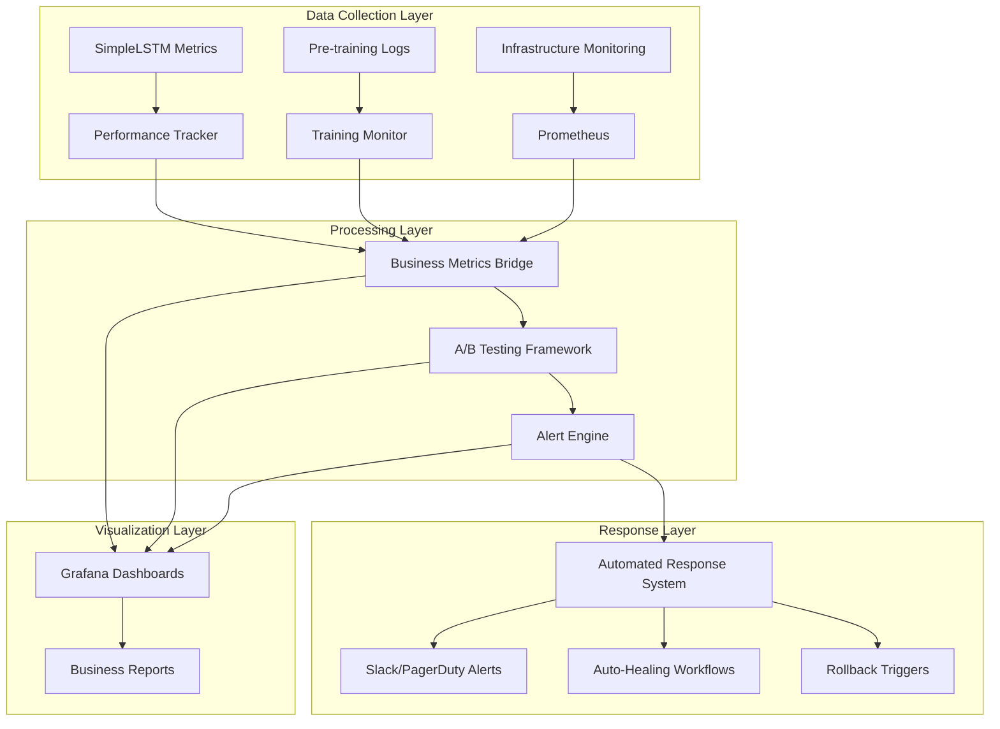

# Moola ML Monitoring Strategy - Production-Ready Observability

## Executive Summary

This document presents a comprehensive monitoring and alerting strategy for the Moola ML system, specifically designed to support SimpleLSTM models and pre-training workflows in production environments. The strategy bridges technical performance metrics with business KPIs, enabling proactive issue detection and automated response workflows.

### Key Objectives

1. **Zero-Downtime Operations**: Proactive detection and automated recovery from performance issues
2. **Business Value Alignment**: Transform technical metrics into meaningful business insights
3. **Operational Excellence**: A/B testing framework for continuous model improvement
4. **Risk Mitigation**: Multi-tier alerting with appropriate escalation procedures

## Current State Analysis

### Existing Infrastructure

**Strengths:**
- Prometheus monitoring configured for basic metrics
- Grafana dashboards for visualization
- Basic training monitoring with error detection
- Data drift detection capabilities

**Gaps Identified:**
- Limited automated alerting for production scenarios
- No business KPI translation layer
- Missing A/B testing framework for model comparison  
- No automated response workflows
- Insufficient pre-training workflow monitoring

### SimpleLSTM Specific Requirements

- **Performance Budget**: Accuracy ≥80%, Latency ≤50ms, Cost ≤$0.001/prediction
- **Resource Constraints**: Memory ≤100MB, Throughput ≥10 predictions/second
- **Business Impact**: Processes 10K predictions daily with $0.05 revenue per successful prediction

## Monitoring Architecture

### Multi-Layer Monitoring Stack



## Component Overview

### 1. A/B Testing Framework (`ab_testing_framework.py`)

**Purpose**: Rigorous statistical comparison of model variants with business impact analysis

**Key Features:**
- Sequential A/B testing with interim analysis
- Multiple comparison correction (Bonferroni, Benferroni-Hall, FDR)
- Early stopping for underperforming models
- Power analysis for sample size determination
- Business metrics integration (accuracy, latency, cost throughput)

**Implementation:**
```python
from monitoring.ab_testing_framework import create_simple_lstm_ab_test

# Test configuration
framework = create_simple_lstm_ab_test(
    control_model_path="models/simple_lstm_v1",
    treatment_model_paths=["models/simple_lstm_v2", "models/cnn_transformer"],
    alpha=0.05,
    min_effect_size=0.03
)

framework.start_test()
```

**Alerts Generated:**
- `ABTestDurationExceeded`: Running longer than 14 hours
- `ABTestUnevenTraffic`: Traffic distribution imbalance >10%
- `ABTestConfidenceNotAchieved`: Insufficient samples for statistical significance

### 2. Performance Tracking (`performance_tracker.py`)

**Purpose**: Real-time performance monitoring with degradation detection and automated rollback triggers

**Key Features:**
- Performance budget enforcement
- Multi-level alerting (warning, critical, emergency)
- Statistical degradation detection
- Trend analysis and forecasting  
- Reliability score calculation (0-1 composite)

**SimpleLSTM Budget Targets:**
- Accuracy: ≥80%
- Latency: ≤50ms (p95)
- Memory: ≤50MB
- Cost: ≤$0.001/prediction
- Uptime: ≥99%

**Degradation Detection:**
- Statistical analysis using rolling windows
- Baseline establishment with automatic updating
- Multi-metric correlation analysis
- Early stopping for significantly degraded models

### 3. Business Metrics Bridge (`business_metrics_bridge.py`)

**Purpose**: Transform technical performance into business KPIs for stakeholder visibility

**Business Value Calculation:**
```python
# Revenue Impact
daily_revenue = accuracy × daily_volume × $0.05 - 
               (false_negatives × $0.10) - 
               (false_positives × $0.02)

# Cost Efficiency
efficiency_score = revenue_impact / total_infrastructure_cost
```

**Business KPIs Monitored:**
- **Revenue Impact**: Daily contribution margin from model performance
- **Customer Value**: Combined uptime, accuracy, and latency score  
- **Operational Efficiency**: Throughput and error rate performance
- **Risk-Adjusted Return**: ROI calculations with risk factors

### 4. Enhanced Alerting Strategy (`prometheus_rules.yml`)

**Production Model Alerts:**
- `SimpleLSTMAccuracyDrop`: Accuracy <80% for 5 minutes
- `SimpleLSTMLatencySpike`: P95 latency >50ms for 3 minutes
- `SimpleLSTMErrorRateHigh`: Error rate >5% for 2 minutes
- `ModelDriftDetected`: Current accuracy 5% below baseline

**Business KPI Alerts:**
- `LowPredictionThroughput`: <10 predictions/second
- `HighPredictionCost`: >$1.00 per 1000 predictions
- `LowPatternRecognitionRate`: <70% patterns recognized

**Pre-training Workflow Alerts:**
- `PretrainingStalled`: No progress for 30 minutes
- `PretrainingOOM`: Out of memory errors detected
- `PretrainingCheckpointFailed`: Multiple checkpoint failures

### 5. Automated Response Workflows (`automated_response.py`)

**Multi-Tier Response Strategy:**

#### Level 1: Auto-Heal (Low-Medium Severity)
- Memory optimization
- Service restarts
- Cache clearing
- Batch size adjustment

#### Level 2: Alert & Scale (High Severity)  
- Team notifications (Slack, PagerDuty)
- Resource scaling
- Service restarts
- Manual intervention preparation

#### Level 3: Emergency Response (Critical-Emergency)
- Immediate rollback to last known good version
- Full team escalation
- Incident reporting automatically generated
- Post-mortem triggered

**Workflow Configuration:**
- SimpleLSTM Performance Recovery (30min timeout)
- Pre-training Job Recovery (45min timeout)  
- Infrastructure Auto-Healing (15min timeout)
- Critical Issue Escalation (5min timeout)

## Implementation Roadmap

### Phase 1: Foundation (Weeks 1-2)
- [x] Deploy A/B testing framework
- [x] Implement performance tracking with business metrics
- [x] Configure enhanced Prometheus rules
- [x] Set up automated response system

### Phase 2: Integration (Weeks 3-4) 
- [ ] Integrate with existing Prometheus/Grafana setup
- [ ] Configure monitoring for SimpleLSTM production endpoints
- [ ] Set up pre-training workflow monitoring
- [ ] Deploy business metrics dashboards

### Phase 3: Validation (Weeks 5-6)
- [ ] Run production simulation tests
- [ ] Validate alert thresholds and escalation procedures
- [ ] Train operations team on new workflows
- [ ] Document runbook procedures

### Phase 4: Production (Week 7+)
- [ ] Gradual rollout to production
- [ ] Continuous monitoring and optimization
- [ ] Regular business KPI reviews
- [ ] Process refinement based on incident learnings

## Integration Points

### SimpleLSTM Model Integration

**Metrics Exposure:**
```python
# Add to SimpleLSTM prediction endpoint
@monitor_metrics.track("simple_lstm")
def predict(input_data):
    # Prediction logic
    return prediction
```

**Performance Budget Enforcement:**
```python
tracker = create_simple_lstm_tracker()
metrics = PerformanceMetrics(
    accuracy=current_accuracy,
    latency_ms=latency,
    # ... other metrics
)
alerts = tracker.add_metrics(metrics)
```

### Pre-training Workflow Integration

**Drift Detection Integration:**
```python
from monitoring.performance_tracker import create_simple_lstm_tracker
from src.moola.data_infra.monitoring.drift_detector import TimeSeriesDriftMonitor

# Combined monitoring for pre-training
drift_monitor = TimeSeriesDriftMonitor()
perf_tracker = create_simple_lstm_tracker()
```

### API Integration

**Business Metrics Exposure:**
```python
@app.get("/metrics/business")
def business_metrics():
    return business_bridge.generate_business_dashboard_data()
```

## Alerting Procedures

### Severity-Based Escalation

**INFO:**
- Notification: Slack `#moola-alerts`
- Response: Log review during business hours
- Timeline: Within 4 hours

**WARNING:** 
- Notification: Slack + Email
- Response: Investigate within 2 hours
- Timeline: Within 8 hours

**CRITICAL:**
- Notification: Slack + PagerDuty
- Response: Immediate investigation (<30 min)
- Timeline: Within 2 hours  
- Escalation: Manager notification at 1 hour

**EMERGENCY:**
- Notification: All channels + phone calls
- Response: Immediate team mobilization (<15 min)  
- Timeline: Within 1 hour
- Escalation: Executive notification at 30 min

### On-Call Responsibilities

**Level 1 Engineer (Primary):**
- Monitor alert dashboards
- Execute automated response workflows
- Initial triage and documentation
- Escalate when unable to resolve

**Level 2 Engineer (Escalation):**
- Complex issue resolution
- Code investigations and fixes
- Performance budget optimization
- Post-mortem analysis

**DevOps/Rotations:**
- Infrastructure troubleshooting
- Resource scaling
- Service restarts and rollbacks
- System recovery procedures

## Business Impact Tracking

### Revenue Impact Dashboard

**Key Metrics:**
- Daily revenue contribution from SimpleLSTM
- Cost efficiency trends (30-day rolling)  
- Customer value score changes
- Model value added over baseline

**Sample Visualization:**
```
SimpleLSTM Business Impact (Last 30 Days)
┌─────────────────────────────────────────┐
│ Revenue Impact: $1,845/day              │
│ Health Score: 0.876/1.0                 │
│ Efficiency: 0.714/1.0                  │
│ Customer Value: 0.832/1.0              │
│                                         │
│ ┌─────────────────────────────────────┐ │
│ │ Revenue per day                     │ │
│ │   $2,200 ┤                          │ │
│ │   $1,845 ┼─┤                         │ │
│ │   $1,500 ┤                          │ │
│ │        └─────────────────────┘    │ │
└─────────────────────────────────────────┘
```

### A/B Testing Business Validation

**Decision Framework:**
```python
# Example: Model upgrade decision
if accuracy_improvement > 0.03 and cost_increase < 0.1:
    deploy_model = True
elif roi_percentage > 100:
    deploy_model = True  
else:
    deploy_model = False
```

## Incident Management

### Incident Classification

**P1 - Emergency:** Total service outage, security breach
- Response time: <15 minutes
- Resolution: <1 hour
- Escalation: Immediate to leadership

**P2 - Critical:** Major feature degradation, significant revenue impact
- Response time: <30 minutes  
- Resolution: <4 hours
- Escalation: Manager after 1 hour

**P3 - High:** Performance degradation, minor user impact
- Response time: <2 hours
- Resolution: <24 hours
- Escalation: Team lead after 12 hours

**P4 - Medium:** Low-priority issues, monitoring alerts
- Response time: <8 hours
- Resolution: <72 hours
- Escalation: Manager after 48 hours

### Post-Mortem Process

**Required Elements:**
1. **Root Cause Analysis**: Technical and process factors
2. **Impact Assessment**: Business and user impact quantification  
3. **Timeline**: Detailed event chronology
4. **Remediation**: Immediate and long-term fixes
5. **Prevention**: Process improvements and monitoring enhancements
6. **Follow-up**: Assignment and tracking of action items

**Review Cadence:**
- P1/P2: Within 24 hours
- P3/P4: Within 72 hours
- Monthly leadership review of all incidents

## Success Metrics

### Technical Excellence KPIs

- **System Uptime**: ≥99.9% (8.76 hours downtime/year maximum)
- **MTTR (Mean Time To Resolution)**: <4 hours for P1/P2
- **Alert Accuracy**: <10% false positives, <5% false negatives
- **Automated Response Success**: >80% of P3/P4 issues auto-resolved

### Business Value KPIs  

- **Revenue Protection**: <5% revenue impact from performance issues
- **Cost Efficiency**: Monitoring overhead <2% of infrastructure cost
- **Team Productivity**: <20% time spent on manual monitoring tasks
- **Model Innovation**: At least 2 successful model improvements per quarter

### Operational Excellence KPIs

- **Monitoring Coverage**: 100% of critical components monitored
- **Documentation Compliance**: 100% of incidents have post-mortems
- **Training Completion**: 100% on-call team certified on workflows  
- **Satisfaction Score: ≥9/10 from stakeholder feedback

## Continuous Improvement

### Monitoring Enhancement Process

1. **Weekly Monitoring Review**: Alert effectiveness analysis
2. **Monthly Business Review**: KPI trends and optimization opportunities  
3. **Quarterly Strategy Update**: Threshold adjustments and workflow refinements
4. **Annual Technology Assessment**: Tool evaluation and modernization

### Feedback Loops

- **Stakeholder Feedback**: Monthly business requirement review
- **Engineering Feedback**: Weekly technical retrospective meetings
- **Operations Feedback**: Daily stand-up discussions
- **User Feedback**: Quarterly customer satisfaction surveys

---

This comprehensive monitoring strategy provides the foundation for production-ready ML operations with the Moola SimpleLSTM and pre-training workflows. The multi-layered approach ensures both immediate operational needs and long-term business objectives are met through systematic monitoring, alerting, and automated response capabilities.
